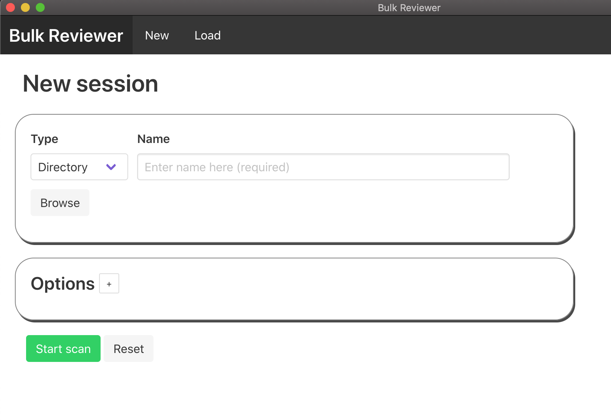

Scanning a new directory or disk image
======================================

To scan a new directory or disk image for sensitive information, first click on the "Scan new directory or disk image" button from the home screen or select "New" from the top navigational menu.

  .. image:: images/NewSessionOptions.png
  :width: 600
  :alt: Image of Bulk Reviewer New session form with Options menu expanded

Processing options
------------------

* **Name (required)**: Enter a name to identify your session. This could be a unique identifier such as an accession number or a brief description. The value entered into this field is used as the basename for the resulting JSON file and reports directory in the home user's ``bulk-reviewer`` directory (this is created by Bulk Reviewer during processing if it does not already exist).
* **Source directory/disk image (required)**: Select a source type of "Directory" for folders of digital files or "Disk image" for disk images. After you have selected the correct source type, use the "Choose directory" or "Choose file" button (depending on source type) to select the source you would like to scan for sensitive information.
* **Use existing bulk_extractor reports**: Select an existing bulk_extractor reports directory. If selected, Bulk Reviewer will not run bulk_extractor but instead read from the feature files in the specified directory. This allows users to run bulk_extractor separately, with any combination of scanners and arguments desired. When selected, the regular expressions, spotlist, and SSN identification mode options below will be ignored. Please note that currently for this option to work the source directory or disk image must be at the same filepath location as they were when the bulk_extractor reports were created.
* **Regular expressions file (optional)**: If desired, use the "Choose file" button to select a plain text file containing `regular expressions <https://www.regular-expressions.info/>`_ to search for in the source directory or disk image. This allows users to search for any number of custom patterns. If a regular expressions file is specified, matches are included along with other features found by bulk_extractor in Bulk Reviewer's JSON output and in the Review Dashboard. To create a regular expressions file to use with Bulk Reviewer, create a plain text file in any text editor and add each regular expression you would like to scan for on its own line.
* **Stoplist directory (optional)**: If desired, use the "Choose directory" button to select a directory containing stoplists to use with bulk_extractor. Stoplists in bulk_extractor are used to exclude known-acceptable features. For more detail, see section "4.4 Suppressing False Positives" of the `bulk_extractor Users Manual <http://downloads.digitalcorpora.org/downloads/bulk_extractor/BEUsersManual.pdf>`_. Stopped features will not be included in Bulk Reviewer's JSON output or the Review Dashboard, but are available for review in the ``_stopped`` feature files present in the reports directory created with each scan. The `domain.txt <https://github.com/bulk-reviewer/bulk-reviewer/blob/master/stoplists/domain.txt>`_ stoplist included in the Bulk Reviewer repository on Github is especially useful for ignoring common Adobe, Microsoft, PURL, and W3 namespaces. Other bulk_extractor stoplists are available for download at http://downloads.digitalcorpora.org/downloads/bulk_extractor/. Note that use of stoplists can dramatically increase processing time.
* **Social Security Number identification mode**: Select from the dropdown the bulk_extractor SSN mode you would like Bulk Reviewer to use. Options are:
	* **Strict** (ssn_mode=0): Default. SSN’s must be prefixed with a “SSN” label. Dashes or spaces in the numbers allowed.
	* **Medium** (ssn_mode=1): No “SSN” prefix required, but dashes are required.
	* **Lenient** (ssn_mode=2): No dashes required. Allow any 9-digit number that matches SSN allocation range.
* **Scanner options**
	* **Include EXIF metadata in results**: If left unchecked, EXIF metadata will not be included in Bulk Reviewer's JSON output or the Review Dashboard. Sensitive information found within EXIF metadata, such as GPS coordinates, will be included regardless.
	* **Include network data (domains, URLs, RFC822 headers, HTTP logs) in results**: If left unchecked, these categories of network data will not be included in Bulk Reviewer's JSON output or the Review Dashboard. Users may want to include network data to search for, e.g., traces of a user's internet search history or fragments of email messages remaining in unallocated space on disk images. It is highly recommended to use stoplists when including network data to avoid having to triage large quantities of benign results. The `domain.txt <https://github.com/bulk-reviewer/bulk-reviewer/blob/master/stoplists/domain.txt>`_ stoplist included in the Bulk Reviewer repository on Github is especially useful for ignoring common Adobe, Microsoft, PURL, and W3 namespaces.

Starting a scan
---------------

Once you have selected the appropriate options, click the "Start scan" button to begin processing. Bulk Reviewer will show a loading icon while processing. Depending on the size of the source and options selected, processing may take a significant amount of time (up to several hours for directories and disk images > 100GB). Because bulk_extractor scales linearly with the number of processing cores available to it, processing will be significantly faster on more powerful multi-core machines.

On each run, Bulk Reviewer will use or create a ``bulk-reviewer`` directory in the user's home directory to save output files. The current status of an in-progress Bulk Reviewer scan can be determined by opening the ``bulk-reviewer.log`` file found in this directory. This log file can also be used to verify that there were no issues in processing and for debugging unexpected results.

Once processing is complete, Bulk Reviewer will load the Review Dashboard.

Outputs
-------

In addition to the ``bulk-reviewer.log`` file, Bulk Reviewer writes two outputs to the ``bulk-reviewer`` home directory for each scan:

* A ``[name].json`` file including contextual metadata about the scan, detailed information for each file in the directory or disk image, and detailed information for each feature found (including its source file).
* A ``[name]_reports`` directory containing bulk_extractor output files. For disk images, this directory will additionally contain annotated bulk_extractor feature files and a `fiwalk <https://forensicswiki.org/wiki/Fiwalk>`_-generated `DFXML <https://forensicswiki.org/wiki/Category:Digital_Forensics_XML>`_ representation of the source disk image.
