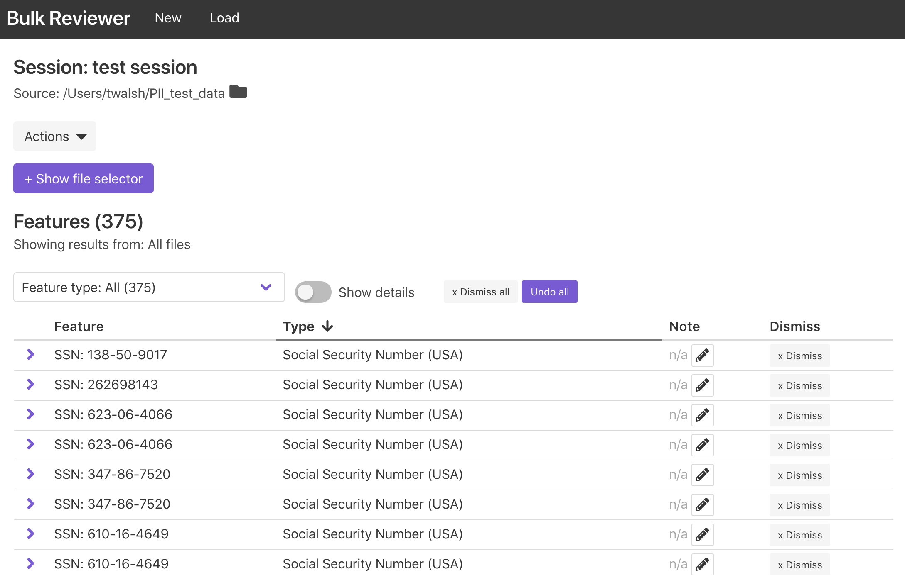
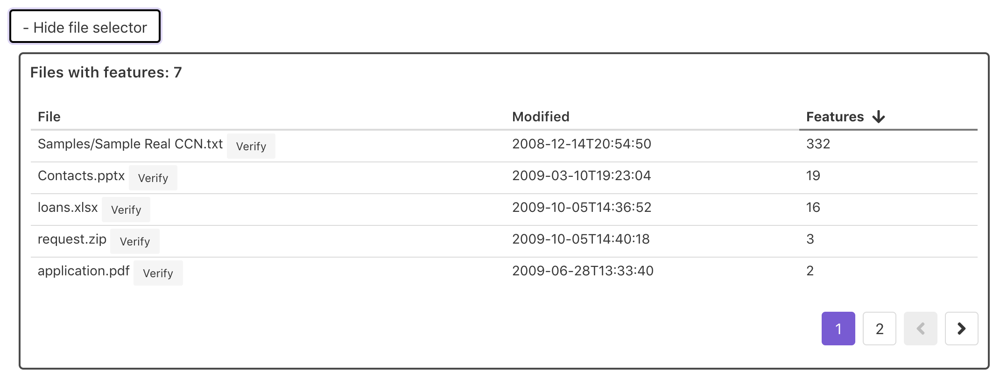
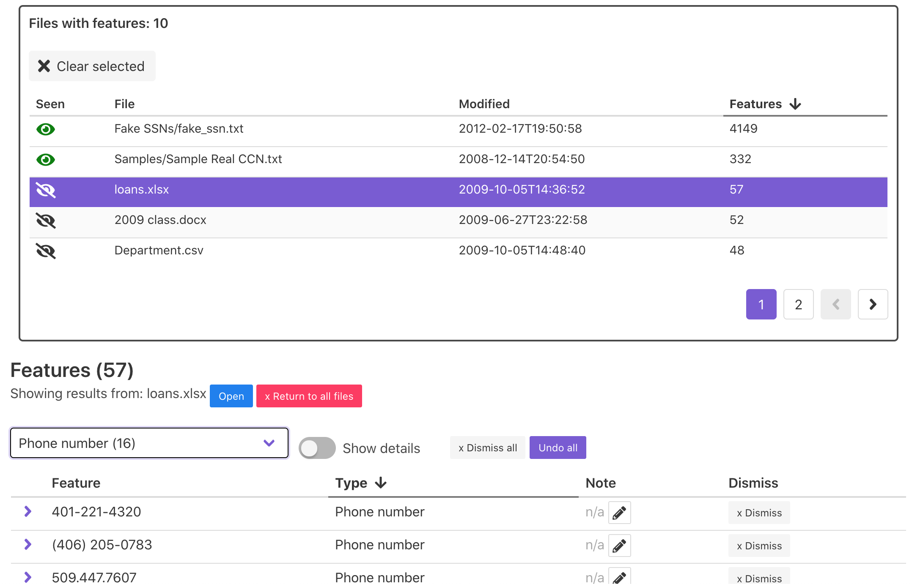
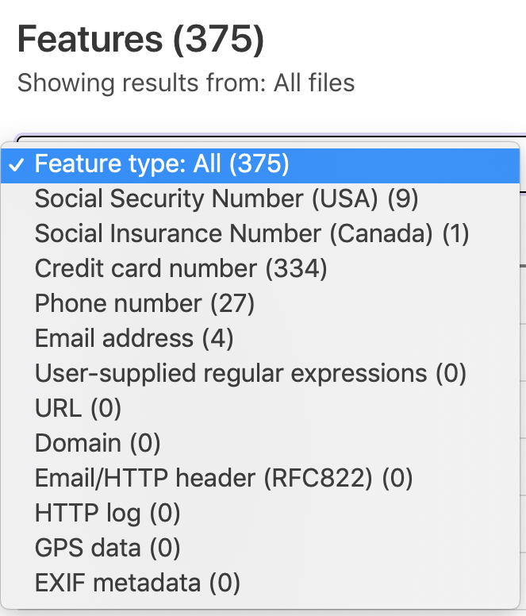
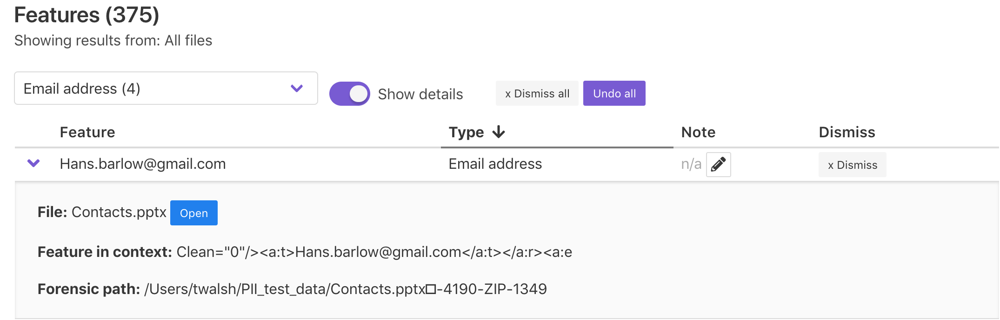
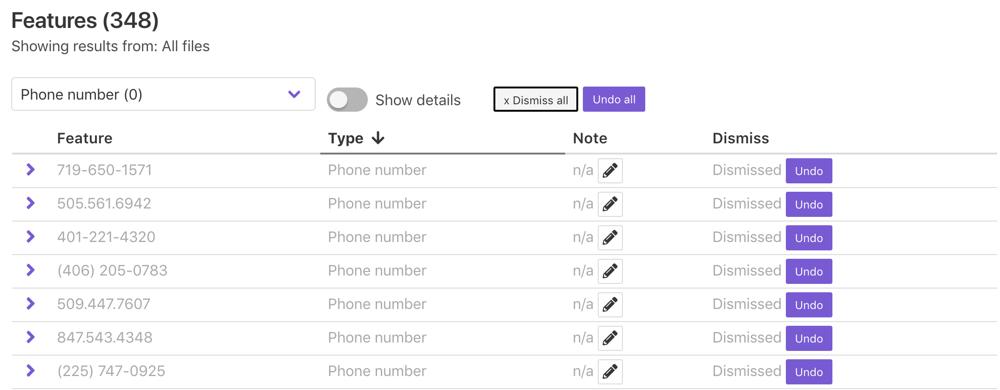
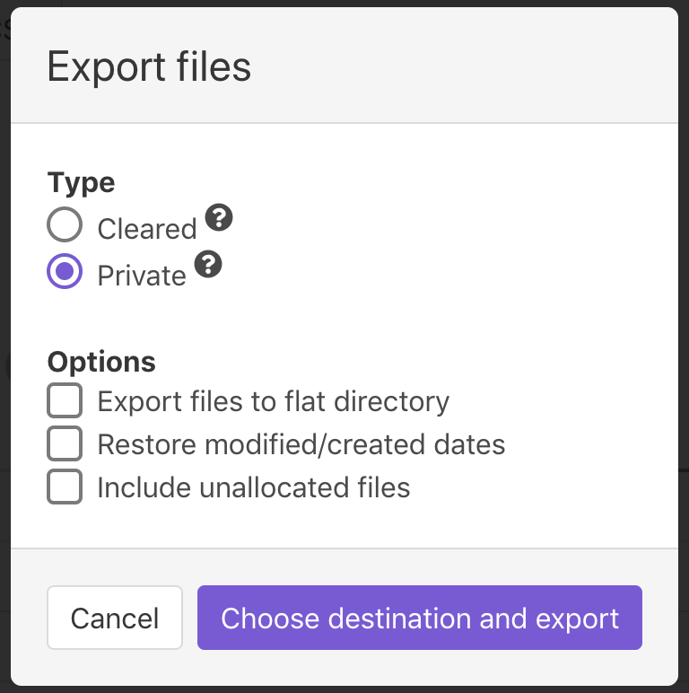

Using the Review Dashboard
==========================

Bulk Reviewer's Review Dashboard is the primary screen for reviewing potentially sensitive information found in a source directory or disk image, dismissing false positives, adding notes, and generating reports and file exports.

The Review Dashboard will be loaded automatically upon completion of processing for new scans. It can also be accessed by loading an existing Bulk Reviewer JSON file by using the "Load from JSON file" button from the home screen or by selecting "Load" from the top navigational menu. This functionality can be used to load previously saved sessions, which enables persisting notes and dismissed features between sessions.

Using the file selector
-----------------------
Features displayed in the feature table can be filtered by their source file using the file selector. To display the file selector, click the "+ Show file selector" button. 

The file selector displays the relative filepath, a last modified or last created timestamp, and the number of features for each file associated with features found by Bulk Reviewer during processing. This table can be sorted on any of the columns.

Selecting a file from the file selector filters the feature table below to include only the features found within that particular file. For directory sources, an "Open" button will also appear which will attempt to open the file using your computer's default application for that filetype to enable closer review. File selection can be cleared using the "Clear selected" button in the file selector or the "Return to all files" button in the feature table.

Each row in the file selector additionally includes an eye icon in the Seen column, which can be used to mark whether a file has been reviewed. The Seen value does not have an impact on other functionality such as file exports.

Displaying feature details
---------------------------
By default, the feature table displays all features found in the source directory or disk image. The feature table can be filtered using the file selector or by using the Feature type dropdown menu to filter by type, and can be sorted on any of the columns.

Each row in the feature table displays by default the following:

* **Feature**: The feature (in other words, matching text) identified by bulk_extractor.
* **Type**: A human-readable feature type label.
* **Note**: An optional note field for use in review and documentation.
* **Dismiss**: If undismissed, a button to dismiss (ignore) that particular feature. If dismissed, indication of this and an Undo button.

Clicking on a feature row or toggling the "Show details" switch on will display additional details for each feature, including:

* **File**: The file within which this feature was found. For directory sources, an "Open" button will also appear which will attempt to open the file using your computer's default application for that filetype to enable closer review.
* **Feature in context**: The feature text shown within context, as recorded by bulk_extractor.
* **Forensic path (directory sources only)**: "For features recovered from uncompressed data, the forensic path is simply the distance in bytes from the beginning of the media. In cases where the feature is contained within an object that is decompressed or otherwise processed by a recursive scanner, the forensic path contains information that can be used to repeat the decoding process." For more information, see Simson L. Garkinkel, "Digital media triage with bulk data analysis and bulk_extractor," Computers & Security 32 (2013), https://doi.org/10.1016/j.cose.2012.09.011.

Dismissing features
-------------------
The Dismissed status is a key piece of information for each feature. Marking a feature dismissed is equivalent to saying to Bulk Reviewer "ignore this feature moving forward". Dismissed features are not counted when determining whether a file qualifies as Private (i.e. containing PII) for file exports.

The "Dismiss all" and "Undo all" buttons can be used to dismiss or un-dismiss all features currently displayed in the feature table. This can be used to selectively dismiss entire categories of features. For example, to quickly dismiss all phone numbers found by Bulk Reviewer, first select "Phone number" from the Feature type dropdown filter and then click the "Dismiss all" button. This will change the status of all features of the "Phone number" type to dismissed without affecting features of other types.

Features that are mistakenly dismissed can be un-dismissed using the "Undo" or "Undo all" buttons.

Saving sessions
---------------
To save the current state of your session, click the "Save" button, located near the top of the screen. Sessions are saved as a JSON file and include all relevant data, including notes and Dismissed status for features and Verified status for files. The resulting dialog will prompt you to choose a location and filename for the save file.

.. image:: images/Actions.png
  :width: 250
  :alt: Image of Actions buttons

At any time later, you can re-load your session from the resulting saved file. For file exports to work properly, the source directory or disk image must be available at the same filepath as recorded.

Exporting files
----------------
Bulk Reviewer supports two main types of file exports: Cleared and Private. To create a file export, first click the "Export files" button, located near the top of the screen. This will open the Export files dialog, where you can select the parameters for and start your export.

**Cleared files** are files associated with no un-dismissed features. This includes files for which bulk_extractor found no private information and files for which all associated features were dismissed during the review process. To export cleared files, choose the "Cleared" file export type. When you are ready to start the export, click the "Choose destination and export" button and then select an empty directory to write the new files to. Bulk Reviewer will copy (or, for disk image sources, carve) each cleared file to this new directory, retaining the original directory structure. The resulting directory will also include a ``_BulkReviewer_README.txt`` file containing contextual information about the source and file export and a list of files excluded from the export for containing PII.

**Private files** are files associated with at least one un-dismissed feature. To export private files, choose the "Private" file export type. When you are ready to start the export, click the "Choose destination and export" button and then select an empty directory to write the new files to. Bulk Reviewer will copy (or, for disk image sources, carve) each private file to this new directory. By default, Bulk Reviewer will retain the original directory structure in Private file exports. If you choose the "Export files to flat directory" option, Bulk Reviewer will instead write the private files to a flat directory. This option is intended to support manual redaction workflows in tandem with the Bulk Reviewer CSV export. In flat exports, files are renamed to include their unique Bulk Reviewer IDs to prevent filename collisions. The resulting directory will also include a ``_BulkReviewer_README.txt`` file containing contextual information about the source and file export.

For **disk image sources**, two additional checkbox options enable users to indicate whether exported files should have their last modified dates restored from values recorded in the DFXML for the disk image and whether to include unallocated files (e.g. deleted files) in exports. These options apply to both Cleared and Private exports.

Downloading CSV reports
-----------------------
To download a CSV representation of the feature data for a Bulk Reviewer session, click the "Download CSV" button, located near the top of the screen. The resulting dialog will prompt you to choose a location and filename for the CSV file. These reports may be particularly helpful in supporting redaction workflows in tandem with flattened Private file exports.

.. image:: images/Actions.png
  :width: 250
  :alt: Image of Actions buttons

Downloading TAR exclude file
-----------------------
To download a TAR exclude file containing the absolute filepath for each file containing PII in a Bulk Reviewer session, click the "Download tar exclude file" button, located near the top of the screen. The resulting dialog will prompt you to choose a location and filename for the tar exclude file. This file can be used in tandem with the ``tar`` utility to create a tarball containing all of the files from the source directory except those containing undismissed PII.

.. image:: images/Actions.png
  :width: 250
  :alt: Image of Actions buttons

