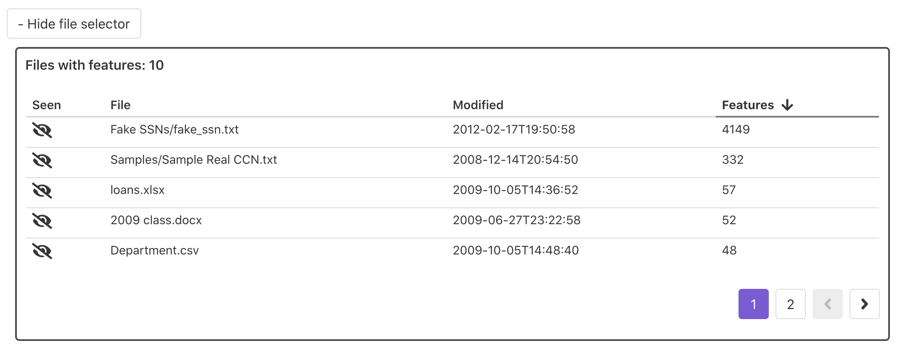
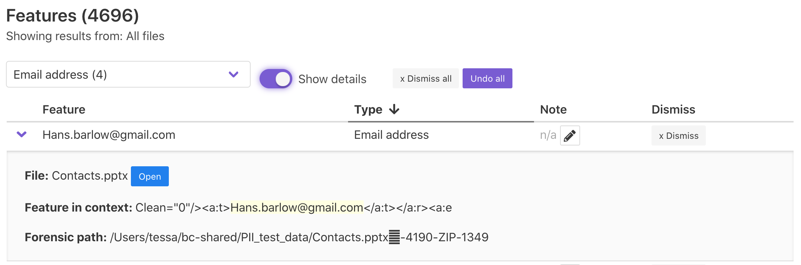
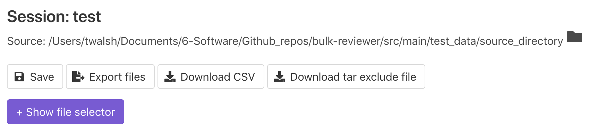

Using the Review Dashboard
==========================

Bulk Reviewer's Review Dashboard is the primary screen for reviewing potentially sensitive information found in a source directory or disk image, dismissing false positives, adding notes, and generating reports and file exports.

The Review Dashboard will be loaded automatically upon completion of processing for new scans. It can also be accessed by loading an existing Bulk Reviewer JSON file by using the "Load from JSON file" button from the home screen or by selecting "Load" from the top navigational menu. This functionality can be used to load previously saved sessions, which enables persisting notes and dismissed features between sessions.

Using the File Selector
-----------------------
Features displayed in the Feature Table can be filtered by their source file using the File Selector. To display the File Selector, click the "+ Show File Selector" button. 

.. image:: images/FileSelectorButton.png
  :width: 300
  :alt: Image of Show File Selector button

The File Selector displays the relative filepath, a last modified or last created timestamp, and the number of features for each file associated with features found by Bulk Reviewer during processing. This table can be sorted on any of the columns.

Selecting a file from the File Selector filters the feature table below to include only the features found within that particular file. For directory sources, an "Open" button will also appear which will attempt to open the file using your computer's default application for that filetype to enable closer review. File selection can be cleared using the "X Clear selected" button in the File Selector or the "x Return to all files" button in the Feature Table.

Each row in the File Selector additionally includes a "Verify" or "Unverify" button, which can be used to toggle the Verified status for a file. When a file is Verified, a green checkmark will appear next to the file name. This is intended to be used only in keeping track of which files have already been reviewed and does not have any affect on other functionality such as file exports.

Displaying feature details
---------------------------
By default, the feature table displays all features found in the source directory or disk image. The feature table can be filtered using the File Selector or by using the Feature type dropdown menu to filter by type, and can be sorted on any of the columns.

.. image:: images/FeatureTypeFilter.png
  :width: 600
  :alt: Image of the feature type dropdown filter

Each row in the feature table displays by default the following:

* **Feature**: The offending text found by bulk_extractor
* **Type**: A human-readable feature type label
* **Note**: An optional note field for use in review and documentation
* **Dismiss**: If undismissed, a button to dismiss (ignore) that particular feature. If dismissed, indication of this and an Undo button.

Clicking on a feature row or toggling the "Show details" switch on will display additional details for each feature, including:

* **File**: The file within which this feature was found. For directory sources, an "Open" button will also appear which will attempt to open the file using your computer's default application for that filetype to enable closer review.
* **Feature in context**: The feature text shown within context, as recorded by bulk_extractor.
* **Forensic path (directory sources only)**: "For features recovered from uncompressed data, the forensic path is simply the distance in bytes from the beginning of the media. In cases where the feature is contained within an object that is decompressed or otherwise processed by a recursive scanner, the forensic path contains information that can be used to repeat the decoding process." For more information, see Simson L. Garkinkel, "Digital media triage with bulk data analysis and bulk_extractor," Computers & Security 32 (2013), https://doi.org/10.1016/j.cose.2012.09.011.

Saving sessions
---------------
To save the current state of your session, choose "Save" from the Actions dropdown menu. Sessions are saved as a JSON file and include all relevant data, including notes and Dismissed status for features and Verified status for files. The resulting dialog will prompt you to choose a location and filename for the save file.

At any time later, you can re-load your session from the resulting saved file. For file exports to work properly, the source directory or disk image must be available at the same filepath as recorded.

Exporting files
----------------
Bulk Reviewer supports two types of file exports: Cleared and Private.

**Cleared files** are files associated with no un-dismissed features. This includes files for which bulk_extractor found no private information and files for which all associated features were dismissed during the review process. To export cleared files, choose "Export cleared files (no PII)" from the Actions dropdown menu and then select an empty directory to write the new files to. Bulk Reviewer will copy (or, for disk image sources, carve) each cleared file to this new directory, retaining the original directory structure. The resulting directory will also include a ``_BulkReviewer_README.txt`` file containing contextual information about the source and file export and a list of files excluded from the export for containing PII.

**Private files** are files associated with at least one un-dismissed feature. To export private files, choose "Export private files" from the Actions dropdown menu and then select an empty directory to write the new files to. Bulk Reviewer will copy (or, for disk image sources, carve) each private file to this new directory. For Private exports, all files are written to a flat directory and renamed to include their unique Bulk Reviewer ID. This is done in order to support redaction workflows in tandem with the Bulk Reviewer CSV export. The resulting directory will also include a ``_BulkReviewer_README.txt`` file containing contextual information about the source and file export.

For disk image sources, two checkboxes located directory above the Actions dropdown menu enable users to indicate whether exported files should have their last modified dates restored from values recorded in the DFXML for the disk image and whether to include unallocated files (e.g. deleted files) in exports. These options apply to both Cleared and Private exports.

.. image:: images/ActionsDiskImage.png
  :width: 300
  :alt: Image of Actions dropdown with disk image options

Downloading CSV reports
-----------------------
To download a CSV representation of the feature data for a Bulk Reviewer session, choose "Download CSV report" from the Actions dropdown menu. The resulting dialog will prompt you to choose a location and filename for the save file. These reports may be particularly helpful in supporting redaction workflows in tandem with Private file exports.

